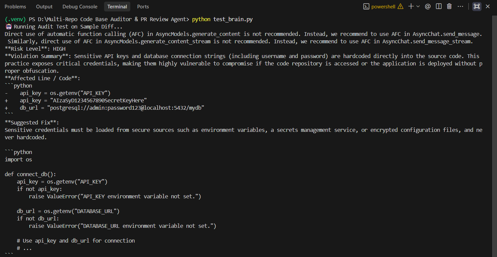
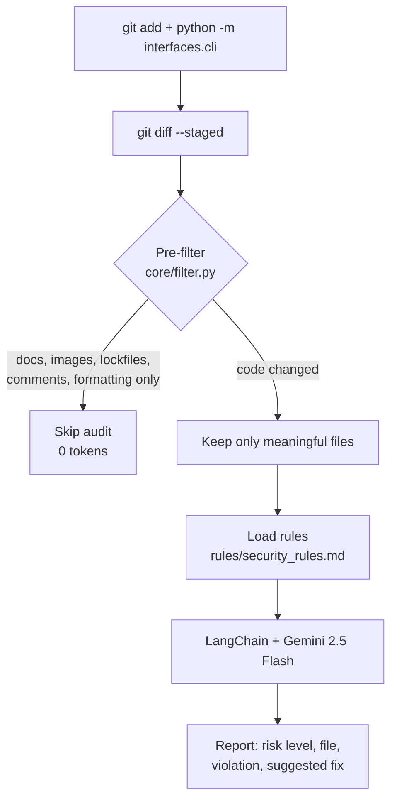

# Sentinel-Code

**A token-efficient AI security auditor for Git diffs.** Sentinel-Code filters out trivial changes locally, then sends only meaningful code changes to an LLM to check against your own security rules.


-orange)


<!-- TODO: add a 20-40s demo GIF here, e.g. docs/assets/demo.gif -->



---

## Why this exists

My first version sent full files to the LLM on every commit. Token usage grew fast, commits got slow, and the model commented on whitespace and documentation changes.

The fix was to stop sending code that doesn't need review. Sentinel-Code decides locally, for free, whether a diff contains a real code change, and only then calls the model.

## How it works



**1. Local pre-filter (no API call).** The diff is split per file. A file is skipped when:
- it is non-code: `.md`, `.txt`, `.rst`, images, lockfiles
- only blank lines or comments changed (language-aware; comments that mention secrets such as `api_key` or `password` are still audited)
- only formatting changed (re-indentation or spacing)

Config files (`.yaml`, `.json`, `.toml`, `.env`) are deliberately **not** skipped, because secrets often leak there.

**2. File-aware context.** Only the files that need review are sent to the model, with their paths, so findings point to the right file.

**3. Rule-based audit.** The diff is checked against `rules/security_rules.md`. Safeguards: the diff is wrapped in `<code_diff>` tags and the model is told to treat it as data (prompt-injection guard), backticks are sanitized, and oversized diffs are cut at a line boundary.

## Results

The filter was replayed over real commit history using `tests/filter_benchmark_test.py`. Token counts are **estimates** (characters ÷ 4) and the baseline is "send every diff to the LLM".

| Repo | Commits | Skipped (0 API calls) | Est. token reduction |
|---|---|---|---|
| This repo | 29 | 16 (55%) | 48% |
| [pallets/click](https://github.com/pallets/click) (last 50 commits) | 50 | 6 (12%) | 15% |

These numbers describe filtering efficiency, not answer quality. Savings depend on the repo. A repo with many documentation and config-only commits benefits most, while a code-heavy repo benefits less. Median filter time is under 1 ms per commit. Full output for this repo: [docs/assets/filter_test_result.md](docs/assets/filter_test_result.md).

## Quick start

```bash
git clone https://github.com/SHREYASHSINGHAI/Multi-Repo-Code-Base-Auditor-PR-Review-Agent.git
cd Multi-Repo-Code-Base-Auditor-PR-Review-Agent

python -m venv .venv
source .venv/bin/activate          # Windows: .venv\Scripts\activate
pip install -r requirements.txt
```

Create a `.env` file from the template and add your Gemini API key ([get one here](https://aistudio.google.com/apikey)):

```bash
cp .env.example .env               # Windows: copy .env.example .env
```

```env
GEMINI_API_KEY=your_api_key_here
MODEL="gemini-2.5-flash"
```

### Audit your staged changes

```bash
git add path/to/file.py
python -m interfaces.cli
```

### Try the bundled example

Runs the auditor on a sample diff that contains a hardcoded fake key and database password:

```bash
python -m tests.test_brain
```

## Customizing the rules

Edit `rules/security_rules.md`. The current rules cover hardcoded credentials, SQL injection, missing auth or rate limiting, leaking error traces, and dangerous system calls (`eval`, `exec`, `os.system`). Add your own as plain markdown. If the file is missing, a short built-in default is used.

## Running the tests and benchmark

```bash
# unit tests for the pre-filter (no API key needed)
python -m pytest tests/test_filter.py

# end-to-end check of the auditor on a diff with fake secrets (calls Gemini, needs API key)
python -m tests.test_brain

# replay the last 50 commits of any local git repo through the filter (free, no API key)
python tests/filter_benchmark_test.py --repo . --n 50
```

The benchmark measures the **filter** (skip rate, estimated tokens, speed). It never calls the LLM, so it says nothing about the quality of the audit reports.

## Project structure

```
.
├── core/
│   ├── auditor_agent.py      # CodeAuditorBrain: prompt, safeguards, LLM call
│   ├── filter.py             # per-file diff filtering
│   └── rules_loader.py       # loads rules/security_rules.md
├── interfaces/
│   └── cli.py                # audits `git diff --staged`
├── rules/
│   └── security_rules.md     # your security and architecture rules
├── tests/
│   ├── test_filter.py        # unit tests for the filter
│   ├── test_brain.py         # end-to-end auditor check (needs API key)
│   └── filter_benchmark_test.py  # filter skip rate and token estimates
├── docs/assets/              # screenshots and benchmark output
├── requirements.txt
├── .env.example
└── LICENSE
```

## Roadmap

| Phase | Scope | Status |
|---|---|---|
| 1 | Local CLI auditor and diff pre-filter | Done |
| 2 | GitHub PR webhook that posts review comments | Planned |
| 3 | Streamlit dashboard for multi-repo compliance tracking | Planned |

## Known limitations

- **Advisory by design.** Sentinel-Code prints a report for your staged changes. It never blocks a commit or push, and you run it yourself after `git add`.
- **Heuristic filtering, not an AST parser.** It works on diff lines. Python docstrings are treated as code, and files skipped by type (`.md`, `.txt`) are never audited, so a secret placed there would be missed.
- **Large diffs are truncated.** After filtering, anything beyond 6,000 characters is not audited.
- **Model output is free-form markdown.** LLMs can miss issues or flag false positives. Use Sentinel-Code as a review aid alongside tools like gitleaks or CodeQL, not as a replacement.
- **Code is sent to a third party.** Audited diffs are sent to Google's Gemini API. Do not use it on code you are not allowed to share with that service.

## Contributing

Issues and pull requests are welcome. Good starting points: more filter edge cases, extra rule sets (for example OWASP-based), and tests.

## License

MIT. See [LICENSE](LICENSE).
